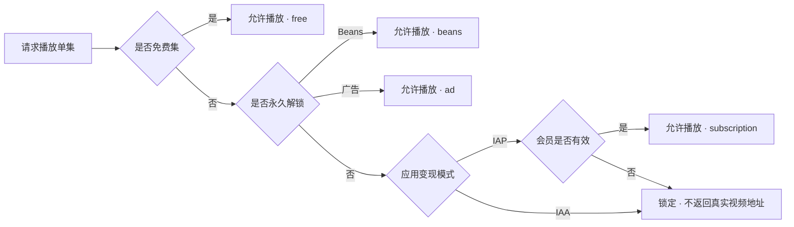
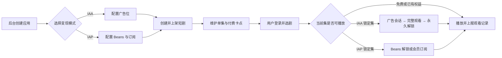
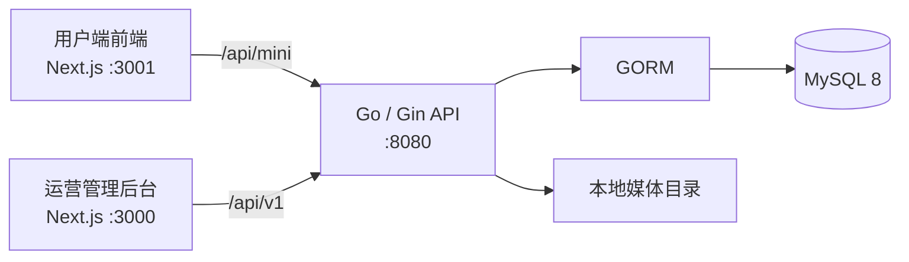

# TikTok Mini Dramas

TikTok 漫剧小程序演示项目。仓库包含用户端前端、运营管理后台和 Go 服务端，用于演示短剧内容管理、剧集播放、用户权益以及 IAA / IAP 两种变现模式的完整业务闭环。

> 本项目用于产品演示和本地联调，没有接入 TikTok 官方登录、支付、订阅或广告平台，不建议直接用于生产环境。

## 业务概览

### 核心角色

| 角色 | 主要能力 |
| --- | --- |
| 小程序用户 | 登录、浏览短剧、选择剧集、观看免费或已解锁内容、通过广告或付费解锁 |
| 运营人员 | 管理小程序、短剧、单集、付费卡点、订阅和 Beans 配置，查询订单与用户权益 |
| 系统管理员 | 管理后台账号、角色和权限 |

### 业务模块

1. **应用管理**
   - 管理多个小程序及其 TikTok App ID、Client Key、主体和启用状态。
   - 每个小程序选择一种变现模式：`IAA` 或 `IAP`，两者互斥。
   - IAA 应用配置激励广告位 ID；IAP 应用使用 Beans 和会员订阅配置。

2. **内容与剧集管理**
   - 创建短剧，维护封面、语言、上下架状态和付费卡点。
   - 批量创建和编辑单集，配置播放地址。
   - 付费卡点之前为免费集，之后按用户权益判断能否播放。

3. **IAA 激励广告解锁**
   - 小程序提前获取广告位 ID，并可在下一集锁定时预加载广告素材。
   - 用户点击广告解锁时，服务端创建广告解锁会话。
   - 广告完整播放后完成会话并永久解锁指定单集；取消或超时不会发放权益。

4. **IAP 付费解锁**
   - **Beans 解锁**：付费面板从用户当前所在集计算到剧终的未解锁集数，并生成可用档位。支付成功后对应单集永久解锁。
   - **会员订阅**：有效期内可观看该小程序下的会员付费集；订阅到期后权益失效，但历史到期时间仍保留。

5. **用户与数据查询**
   - 查询小程序用户、订阅状态、最后到期时间、Beans / 广告永久解锁记录和观看记录。
   - 充值订单支持筛选、查看和导出。

6. **后台权限**
   - 使用 JWT、单设备会话和 RBAC 权限控制后台接口。
   - 前端菜单、路由与权限映射由菜单注册表统一派生。

### 变现模式

| 模式 | 用户行为 | 权益范围 | 有效期 |
| --- | --- | --- | --- |
| 免费集 | 直接播放付费卡点之前的剧集 | 指定免费单集 | 长期有效 |
| IAA 广告解锁 | 完整观看一次激励广告 | 指定单集 | 永久有效 |
| IAP Beans 解锁 | 购买当前集之后的指定档位 | 订单包含的单集 | 永久有效 |
| IAP 会员订阅 | 购买周、月、季度、半年或年订阅 | 有效期内全部会员付费集 | 截止订阅到期时间 |

### 播放权限判定



永久权益优先于订阅权益。IAA 应用不使用历史订阅权益；锁定集不会向前端返回真实播放地址。

### 主要业务流程



## 系统架构



### 技术栈

| 层级 | 技术 |
| --- | --- |
| 用户端前端 | Next.js 16、React 19、TypeScript、Tailwind CSS 4 |
| 管理后台 | Next.js 16、React 19、TypeScript、Tailwind CSS 4 |
| 服务端 | Go 1.22+、Gin、GORM |
| 数据库 | MySQL 8、utf8mb4 |
| 后台认证 | JWT、SessionGuard、RBAC |
| ID | 雪花算法 |

## 仓库结构

```text
.
├── admin-Base/
│   ├── app/                    # 管理后台页面入口
│   ├── components/             # 应用、短剧、用户、订单、订阅等后台组件
│   ├── lib/                    # API、菜单注册表、权限与公共工具
│   ├── docs/                   # 小程序接口和 IAA 设计文档
│   └── backend/
│       ├── cmd/server/         # Go 服务入口
│       ├── internal/handler/   # HTTP 路由与请求处理
│       ├── internal/service/   # 业务服务与统一权益解析
│       ├── internal/model/     # GORM 数据模型
│       └── migrations/         # 初始化账号和角色数据
├── mobile-app/
│   ├── app/                    # 用户端页面入口
│   ├── components/             # 首页、播放页、付费面板和个人中心
│   └── lib/                    # 小程序 API 与国际化
└── README.md
```

## 本地运行

### 环境要求

- Node.js 20+
- pnpm 10+
- Go 1.22+
- MySQL 8+

### 1. 初始化数据库和后端

```bash
cd admin-Base/backend
cp config.yaml.example config.yaml
```

编辑 `config.yaml`，至少配置 MySQL 连接和 JWT Secret。先创建数据库：

```sql
CREATE DATABASE tiktok_mini_drama
  CHARACTER SET utf8mb4
  COLLATE utf8mb4_unicode_ci;
```

启动服务：

```bash
go run ./cmd/server
```

服务启动时通过 GORM `AutoMigrate` 创建或补充业务表结构。需要默认管理员时，在表结构创建后导入种子数据：

```bash
mysql -u root -p tiktok_mini_drama < migrations/001_init.up.sql
```

### 2. 启动管理后台

```bash
cd admin-Base
pnpm install --frozen-lockfile
pnpm dev
```

访问：<http://localhost:3000>

演示模式下可使用任意合法邮箱登录；推荐使用初始化账号 `admin@admin.com`。

### 3. 启动用户端前端

```bash
cd mobile-app
pnpm install --frozen-lockfile
pnpm dev
```

访问：<http://localhost:3001>

### 默认端口

| 服务 | 地址 |
| --- | --- |
| 管理后台 | `http://localhost:3000` |
| 用户端前端 | `http://localhost:3001` |
| Go API | `http://localhost:8080` |
| 健康检查 | `http://localhost:8080/api/v1/health` |

## 演示模式边界

- 小程序登录使用项目内模拟流程，不调用 TikTok OAuth。
- Beans 支付和会员订阅通过“创建订单 → 上报支付结果 → 发放权益”模拟。
- 激励广告由前端模拟播放结果，服务端负责会话状态与单集权益发放。
- 媒体默认保存在本地目录，不包含 CDN、对象存储签名和生产级转码流程。
- 表结构由 GORM `AutoMigrate` 管理，适用于演示环境；正式上线应改为版本化数据库迁移。
- CORS、登录便利配置和第三方回调校验均需在生产环境重新设计。

## 文档

后续功能迭代必须遵守对应子项目的架构设计；确需调整架构时，应先更新文档并在代码变更中说明原因。

- [管理后台架构设计与开发规范](admin-Base/ARCHITECTURE.md)
- [服务端架构设计与开发规范](admin-Base/backend/ARCHITECTURE.md)
- [小程序前端架构设计与开发规范](mobile-app/ARCHITECTURE.md)
- [小程序 API 文档](admin-Base/docs/mini-api.md)
- [数据库初始化策略](admin-Base/backend/migrations/README.md)

## 验证命令

```bash
cd admin-Base/backend
go test ./...
go vet ./...
```

```bash
cd admin-Base
pnpm run build
```

```bash
cd mobile-app
pnpm run build
```
