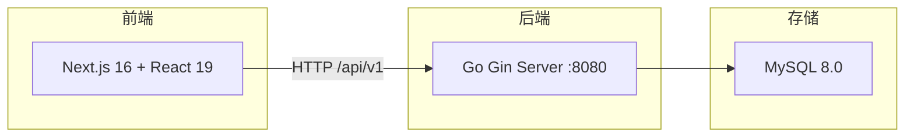
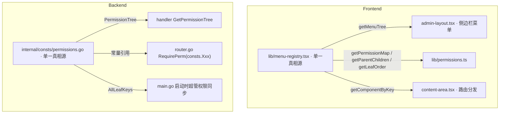
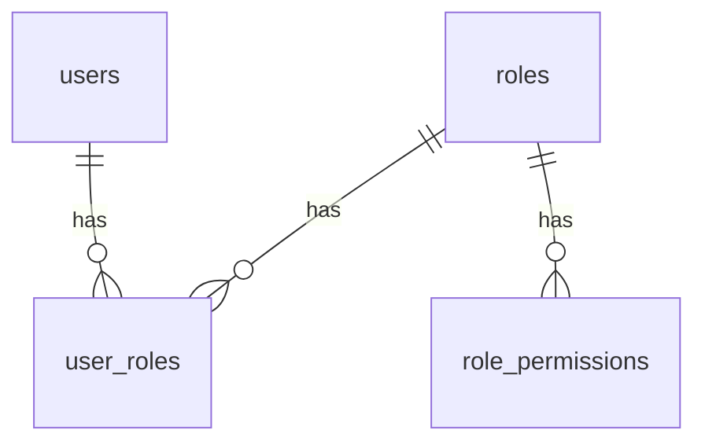
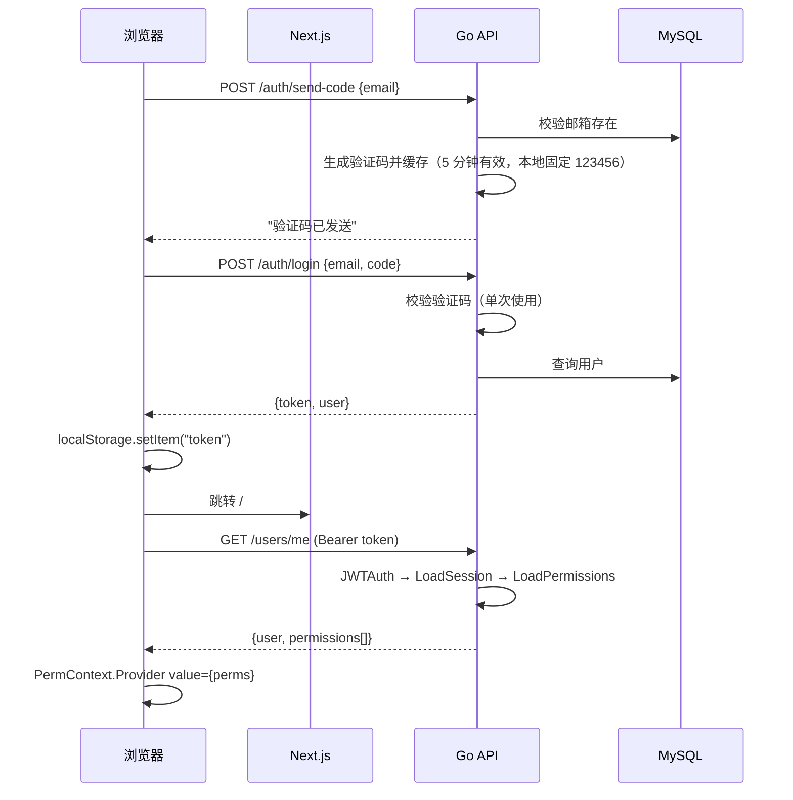

# 后台脚手架 — 技术架构文档

## 一、系统概览

"后台脚手架"是一套「前端 Next.js + 后端 Gin + MySQL」的运营后台骨架，内置：登录（邮箱 + 验证码）、JWT 鉴权、RBAC 权限体系、用户/角色管理、统一响应格式、分页与筛选的标准写法、以及一套落在 `.cursor/rules/design-system.mdc` 的全局 UI 规范。

所有业务功能均已剥离，仅保留「系统设置 → 用户管理 / 角色管理」作为脚手架样板。后续新项目基于本脚手架扩展业务模块即可。



## 二、单一真相源（架构核心）

脚手架把"新增一个业务模块"的改动点压缩到最少 —— 前后端各有一个文件作为权威声明，其他地方全部派生。



## 三、技术栈

### 前端

- **框架**: Next.js 16.2 (App Router, Turbopack) + React 19.2
- **语言**: TypeScript 5.7 (strict mode)
- **样式**: Tailwind CSS 4.2 + tw-animate-css，PostCSS 经由 `@tailwindcss/postcss`
- **图标**: Lucide React
- **工具**: `clsx` + `tailwind-merge` 封装为 `cn()`
- **路径别名**: `@/*` → 项目根目录
- **设计原则**: 自研的轻量 UI 层，不引入 shadcn/ui / Radix / react-hook-form 等重量级依赖；所有筛选/弹窗/抽屉均由 `components/shared` 提供。

### 后端

- **语言**: Go 1.22+
- **框架**: Gin 1.10
- **ORM**: GORM 1.25 + MySQL Driver
- **认证**: JWT (HS256, `golang-jwt/jwt/v5`)
- **跨域**: gin-contrib/cors

### 数据库

- **MySQL 8.0**, 默认库名 `scaffold_admin_template`, 字符集 `utf8mb4`

## 四、项目目录结构

```
后台脚手架/
├── app/                        # Next.js App Router
│   ├── layout.tsx              # 根布局
│   ├── page.tsx                # 首页 → AdminLayout
│   ├── login/page.tsx          # 登录页（邮箱 + 验证码）
│   └── globals.css             # 全局样式
├── components/                 # 业务组件
│   ├── admin-layout.tsx        # 主框架（认证/权限/菜单/路由）
│   ├── sidebar.tsx             # 侧边栏
│   ├── header.tsx              # 顶部栏
│   ├── content-area.tsx        # 按 selectedKey 动态加载业务页（registry 驱动）
│   ├── user-management.tsx     # 用户管理
│   ├── role-management.tsx     # 角色管理
│   ├── list-pagination.tsx     # 分页组件
│   ├── global-toast.tsx        # 全局 Toast
│   └── shared/                 # 复用业务组件
│       ├── filter-input.tsx    # 筛选：文本框
│       ├── filter-bar.tsx      # 筛选：统一筛选栏（等宽网格，行列对齐，minColWidth 默认 300）
│       ├── select-filter.tsx   # 筛选：下拉单选
│       ├── multi-select-filter.tsx # 筛选：下拉多选
│       ├── date-range-picker.tsx   # 筛选：日期区间（双月并行）
│       ├── status-badge.tsx    # 状态标签
│       ├── confirm-dialog.tsx  # 确认弹窗
│       ├── right-drawer.tsx    # 右侧抽屉
│       ├── field-error.tsx     # 字段级错误提示
│       └── index.ts            # barrel export
├── hooks/
│   ├── use-filters.ts          # 筛选 draft/active 双态
│   └── use-pagination.ts       # 分页状态
├── lib/
│   ├── menu-registry.tsx       # ★ 菜单/权限/路由分发单一真相源
│   ├── api.ts                  # API 接口聚合（authApi / userApi / roleApi）
│   ├── api-client.ts           # Token & request 封装
│   ├── permissions.ts          # 派生自 menu-registry
│   ├── toast.ts                # Toast 发布订阅
│   ├── format.ts               # 日期等格式化
│   ├── types.ts                # 共享类型
│   └── utils.ts                # cn() 工具
├── public/                     # icon 资源
├── .cursor/rules/              # 设计规范（跟随仓库）
│   └── design-system.mdc
├── backend/                    # Go 后端
│   ├── cmd/server/main.go      # 入口（启动做超管权限 sync）
│   ├── config.yaml.example     # 配置示例
│   ├── internal/
│   │   ├── config/config.go    # 配置类型 + DSN
│   │   ├── consts/
│   │   │   ├── status.go       # 用户状态枚举
│   │   │   └── permissions.go  # ★ 权限 key 常量 + 权限树 + AllLeafKeys
│   │   ├── handler/            # 薄层 handler（只做 bind + 调 service + 响应）
│   │   │   ├── router.go       # 路由表（RequirePerm 引用 consts 常量）
│   │   │   ├── auth.go         # 登录 / 发送验证码
│   │   │   ├── user.go         # 用户 CRUD
│   │   │   ├── role.go         # 角色 + 权限树（直接返回 consts.PermissionTree）
│   │   │   ├── context.go      # Svc 注入
│   │   │   └── helpers.go      # Bind / ParseID / TrimQuery
│   │   ├── middleware/
│   │   │   ├── jwt.go          # JWT 签发/验证
│   │   │   ├── loadperms.go    # 加载用户权限缓存
│   │   │   ├── session.go      # 会话（单设备登录）
│   │   │   ├── permission.go   # RequirePerm
│   │   │   └── dedup.go        # 写请求去重
│   │   ├── model/
│   │   │   ├── db.go           # GORM 初始化 + AutoMigrate
│   │   │   └── user.go         # User / Role / UserRole / RolePermission
│   │   ├── service/            # 业务逻辑层
│   │   │   ├── service.go      # DI 聚合
│   │   │   ├── user.go         # List / Create / Update / GetByID / GetByEmail
│   │   │   └── role.go         # List / Create / Update / SyncSuperAdminPermissions
│   │   └── pkg/
│   │       ├── response/       # 统一响应
│   │       └── pagination/     # 分页解析
│   └── migrations/             # SQL 迁移（仅账号种子，不含权限点）
│       ├── 001_init.up.sql
│       └── 001_init.down.sql
├── next.config.mjs
├── tsconfig.json
├── pnpm-lock.yaml
└── package.json
```

## 五、数据库设计

### ER 关系



### 数据表（4 张，仅账号体系）

- **users** — 用户，email 唯一，状态 启用/禁用
- **roles** — 角色，name 唯一
- **user_roles** — 用户-角色关联（多对多）
- **role_permissions** — 角色-权限（存放 `module.entity.action` 的权限 key）

表结构由 GORM AutoMigrate 创建；`001_init.up.sql` 只种入默认超管账号 + 角色，权限点由后端启动时自动同步。

## 六、API 接口

### 统一响应格式

```json
{ "code": 0, "message": "success", "data": {} }
```

分页接口：`data: { "total": 100, "list": [...] }`

### 接口总览

**公开接口**

- `POST /auth/send-code` — 发送邮箱验证码（本地开发固定为 `123456`）
- `POST /auth/login` — 邮箱 + 验证码登录，返回 JWT
- `GET /health` — 健康检查

**需要 JWT**

- `GET /users/me` — 当前用户信息 + 权限列表
- `GET /users` / `POST /users` / `PUT /users/:id` — 用户管理
- `GET /roles` / `POST /roles` / `PUT /roles/:id` — 角色管理
- `GET /permissions/tree` — 权限树（给角色编辑页用，直接返回 `consts.PermissionTree`）

## 七、认证与权限

### 认证流程



### 权限控制

**后端**: JWT 中间件 → 会话加载权限到 context → `RequirePerm(consts.Xxx)` 路由级校验。权限 key 全部引用 `internal/consts/permissions.go` 的常量，不允许硬编码字符串。

**前端**:
- **菜单可见性**: `lib/menu-registry.tsx` 的 `menuRegistry` 声明每个叶子节点的 `permission`；`lib/permissions.ts` 通过 `getPermissionMap` / `getParentChildren` 派生出映射，`AdminLayout` 按此过滤侧边栏。
- **按钮级**: `usePerm(key)` hook 返回 boolean，组件内 `{canXxx && <Button />}` 控制可见。
- **拦截规则**: 无权限菜单不显示，`selectedKey` 自动重定向到 `getFirstAllowedKey()`。

### 启动权限同步

`main.go` 启动时调用 `Svc.Role.SyncSuperAdminPermissions()`：以 `consts.AllLeafKeys()` 为准，把超管角色缺失的权限点补进 `role_permissions`。新增权限常量后重启后端即可生效，**无需写 SQL 迁移**。

### 默认权限点

脚手架默认仅内置「系统设置」模块的 6 个权限点（集中声明在 `internal/consts/permissions.go`）：

- `system.user.list` / `system.user.add` / `system.user.edit`
- `system.role.list` / `system.role.add` / `system.role.edit`

### 默认角色

- **超级管理员**: 拥有全部权限。`admin@admin.com` 被种子关联到该角色。
- 其余角色由衍生项目按需添加。

## 八、前端路由机制

系统采用 **SPA 式 `selectedKey` 切换**，非 Next.js 文件路由：

- `/` — `AdminLayout`（主框架）
- `/login` — 登录页
- 业务页面通过 `ContentArea` 基于 `selectedKey` 渲染；组件映射来自 `lib/menu-registry.tsx` 的 `getComponentByKey(key)`
- 优势：切换页面不刷新，保持侧边栏/Header 状态；新增菜单不必再改 `content-area.tsx` 的 if/else 分发

## 九、后端分层

```
HTTP 请求
    ↓
中间件链（JWT → Session → LoadPermissions → Dedup → RequirePerm）
    ↓
handler（参数绑定 + 校验 + 响应封装）  ← 薄层
    ↓
service（业务逻辑：事务、密码 hash、权限同步、软约束）
    ↓
model（GORM 调用）
    ↓
MySQL
```

**硬性规则**：handler 不得直接调 `model.DB` 做查询/写入；所有 DB 触点必须经 `Svc.User` / `Svc.Role`。helpers 层只保留 `BindOrFail` / `ParseID` / `TrimQuery`。

## 十、环境配置

### 前端 `.env.local`

```
NEXT_PUBLIC_API_BASE=http://127.0.0.1:8080/api/v1
```

### 后端 `config.yaml`（复制自 `config.yaml.example`）

```yaml
server:
  port: 8080
  mode: debug

database:
  host: 127.0.0.1
  port: 3306
  user: root
  password: ""
  dbname: scaffold_admin_template
  charset: utf8mb4

jwt:
  secret: "change-me-to-a-random-string"
  expire_hours: 24
```

## 十一、启动与部署

### 初始化数据库

```sh
# 1. 启动后端一次让 AutoMigrate 建好表
cd backend
cp config.yaml.example config.yaml
go run ./cmd/server           # 建完表即可 Ctrl+C

# 2. 导入默认超管账号
mysql -u root -p < migrations/001_init.up.sql

# 3. 正式启动（第二次起动时会自动做超管权限同步）
go run ./cmd/server
```

初始化完成后，即可使用 `admin@admin.com` 登录（本地开发验证码固定 `123456`，见 `backend/internal/handler/auth.go` 的 `devFixedLoginCode`）。

### 开发环境

```sh
# 1. 启动后端
cd backend
go run ./cmd/server

# 2. 启动前端
pnpm install
pnpm dev     # 监听 0.0.0.0:3000
```

### 局域网访问

- 前端：`http://<内网 IP>:3000`
- 后端：`http://<内网 IP>:8080`
- 需配置：`next.config.mjs` 的 `allowedDevOrigins` + 防火墙放行 3000/8080 端口

## 十二、基于脚手架扩展新业务的推荐步骤

理想改动面：**前端改 1 文件 + 后端改 1 文件 + 新建 handler/service/model。**

### 1. 后端

1. **权限点**（改一处）：在 `backend/internal/consts/permissions.go` 的 `const` 追加权限 key，并挂进 `PermissionTree` 对应节点的 `Children`。
2. **模型层**：`backend/internal/model/xxx.go` 新增 GORM 模型，挂进 `db.go` 的 `AutoMigrate`。
3. **Service 层**：`backend/internal/service/xxx.go` 声明接口 + 实现；挂进 `service.Services`。
4. **Handler 层**：`backend/internal/handler/xxx.go` 新建薄层 handler（仅做 bind + 调 Svc + 响应）。
5. **路由**：`router.go` 注册路由，`RequirePerm(consts.XxxAction)` 引用常量。

**无需**：再动种子 SQL — 启动时自动同步超管权限。

### 2. 前端

1. **菜单**（改一处）：在 `lib/menu-registry.tsx` 的 `menuRegistry` 追加菜单项，声明 `{ key, label, permission, component: lazyPage(...) }`。
2. **业务组件**：在 `components/` 下新增 `xxx-management.tsx`（抄 `components/user-management.tsx` 为模板），严格遵循 `.cursor/rules/design-system.mdc` 的单卡片布局与按钮规范。
3. **API**：在 `lib/api.ts` 追加 `xxxApi`。

**无需**：改 `admin-layout.tsx`、`content-area.tsx`、`lib/permissions.ts`（全部从 registry 派生）。
