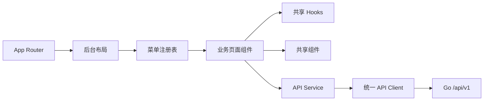

# 管理后台架构设计与开发规范

> 适用范围：本目录中的 Next.js 管理后台，不包含 `backend/`。本文是管理后台后续功能迭代的约束文档；新增页面或功能必须遵守，确需偏离时应先更新本文并说明原因。

## 1. 架构目标

管理后台采用 Next.js App Router + React + TypeScript 的模块化前端架构：

- 菜单、页面注册和前端权限使用单一真相源。
- HTTP、格式化、筛选、分页和公共交互组件集中复用。
- 业务组件负责页面状态与业务交互，不重复实现基础设施。
- 前端权限只改善体验，服务端权限才是安全边界。



## 2. 目录职责

```text
admin-Base/
├── app/                    # App Router、根布局、登录页和全局样式
├── components/             # 业务页面和后台框架组件
│   └── shared/             # 与业务领域无关的通用 UI 组件
├── hooks/                  # 分页、筛选、下拉数据等复用状态逻辑
├── lib/
│   ├── menu-registry.tsx   # 菜单、页面和前端权限单一真相源
│   ├── api-client.ts       # Token、请求、响应和错误处理
│   ├── api.ts              # 兼容性公共 barrel，保持 @/lib/api 导入稳定
│   ├── api/                # 按稳定业务领域拆分的接口与 wire DTO
│   ├── format.ts           # UTC 时间和展示格式
│   ├── permissions.ts      # 从注册表派生的权限结构
│   └── types.ts            # 跨页面共享类型
├── public/                 # 静态资源
└── backend/                # 独立 Go 服务端项目
```

依赖方向：

```text
app/layout → menu registry → business components
business components → hooks/shared/lib
hooks → lib
api.ts → api/* → api-client.ts
```

`lib` 和共享组件不得反向依赖具体业务页面。

## 3. 菜单、路由与权限单一真相源

[lib/menu-registry.tsx](./lib/menu-registry.tsx) 是前端业务菜单的唯一声明位置，并派生：

- 侧边栏菜单。
- 页面组件分发。
- 面包屑或父子关系。
- 权限映射。
- 叶子节点顺序。

新增管理页面时：

1. 创建业务页面组件。
2. 在 `menuRegistry` 对应分组添加 `{ key, label, permission, component }`。
3. 在服务端 `internal/consts/permissions.go` 声明匹配的权限 key。
4. 在服务端路由使用 `RequirePerm` 保护接口。

禁止再到布局、侧边栏和内容分发组件中分别维护相同页面配置。

权限树只声明已有页面或接口能够执行的真实操作；不得为尚不存在的整剧删除、小程序用户编辑或资产配置能力预留无效权限。前端按钮隐藏不是授权机制。新增、编辑、删除、导出等敏感操作必须有服务端权限校验。

## 4. API 访问规范

### 4.1 统一传输层

所有后台请求必须通过 [lib/api-client.ts](./lib/api-client.ts)，统一处理：

- API Base URL。
- JWT Token。
- JSON 编解码。
- HTTP 和业务错误。
- 登录失效处理。
- 请求选项。

禁止在业务组件中散落原生 `fetch`、重复拼 Token 或自行解析不同响应格式。

### 4.2 领域 API

接口方法在 [lib/api/](./lib/api/) 内按应用、短剧、用户、订单、订阅等稳定业务领域组织。[lib/api.ts](./lib/api.ts) 是兼容性公共 barrel，必须持续导出既有服务和类型，使页面统一从 `@/lib/api` 调用语义化方法，而不拼接接口路径。禁止绕过 barrel 创建第二套公共入口。

新增或修改接口时必须：

- 同步 TypeScript 请求/响应类型。
- 保持服务端字段命名一致。
- 将可选查询条件明确序列化。
- 不把异常转换为空数据；由页面统一展示失败状态。

### 4.3 媒体和时间

- 媒体相对路径通过公共方法转换成可访问 URL。
- API 时间按 UTC 解析。
- 后台统一以 `Asia/Shanghai` 显示到秒。
- 日期筛选按中国运营日转换为 UTC 左闭右开区间。
- 禁止页面自行截取时间字符串或手写时区偏移。

格式化入口：[lib/format.ts](./lib/format.ts)。

## 5. 页面与状态设计

### 5.1 页面组件

一个业务页面通常只负责：

- 字段和列定义。
- 筛选条件组合。
- 调用领域 API。
- 打开表单、确认框或详情抽屉。
- 展示成功和失败反馈。

当组件同时承担大量请求、转换、表格、抽屉和状态机逻辑时，应优先拆出 Hook、子组件或领域工具，而不是继续扩大单文件。

### 5.2 分页与筛选

所有活跃分页列表（包括详情 Tab 内的记录列表）使用唯一请求实现 [hooks/use-paged-query.ts](./hooks/use-paged-query.ts)，统一请求、刷新、加载、错误和过期响应抑制。筛选草稿与已应用条件使用 [hooks/use-filters.ts](./hooks/use-filters.ts)；[hooks/use-pagination.ts](./hooks/use-pagination.ts) 仅提供页码状态和视图属性，不得作为另一套列表请求实现。

规则：

- 页码和每页数量是请求状态的一部分。
- 应用新筛选时回到第一页。
- 切换不同详情 Tab 时应使用独立 key 或状态，避免分页串用。
- 请求错误必须可见，不能静默显示为空列表。
- 服务端必须在数据库分页之前应用筛选。

### 5.3 下拉数据

应用和短剧等跨页面下拉选项使用：

- [hooks/use-app-options.ts](./hooks/use-app-options.ts)
- [hooks/use-drama-options.ts](./hooks/use-drama-options.ts)

新增可复用字典或级联选项时，应建立相同模式的 Hook，统一加载、转换和错误处理，不在多个页面复制请求。

## 6. 共享组件规范

通用后台交互位于 [components/shared/](./components/shared)：

- `popconfirm`：危险操作确认。
- `right-drawer`：详情和编辑抽屉。
- `action-button`：列表操作按钮和详情复制按钮（`ActionButton`、`CopyButton`）。
- `fixed-header-table`：固定表头表格。
- `filter-bar`、`filter-input`、`select-filter`：筛选区域。
- `date-range-picker`：运营日期范围。
- `form-input`、`form-select`、`field-error`：表单和字段错误。
- `status-badge`、`monetization-badge`：状态和变现模式展示。
- `column-settings`：列配置。

新增组件前先判断是否为通用能力：

- 通用能力放 `components/shared`，API 应保持领域无关。
- 业务专用组件放对应业务组件附近。
- 不为一个页面复制已有弹窗、抽屉、筛选栏或分页实现。

## 7. 业务展示规范

### 列表操作按钮

- 列表页创建入口统一命名为“新建**”，例如“新建用户”“新建剧集”。
- 新建按钮只显示文字，不添加 `+` 字符或加号图标。
- 应用选项同时展示变现模式时，使用 `MonetizationBadge`，不使用名称后的括号纯文本。
- 详情抽屉中的可复制业务信息统一使用 `CopyButton`；按钮显示复制图标和“复制”文字，不按 JSON、链接等内容类型改变文案，除非同一区域存在多个复制动作且必须消歧。长链接必须单行缩略展示、通过按钮完整复制原值，不依赖用户手动选择文本，操作结果通过 toast 反馈。
- 列表“操作”列统一使用 `ActionButton`：查看、详情、编辑、上架等常规操作使用绿色描边样式，删除、下架等破坏性操作使用红色描边样式；同一行多个操作按钮保持一致的高度、圆角、字号与间距，禁止页面自行使用纯文字链接或另一套按钮样式。
- IAA/IAP 在列表、筛选选项和详情中的展示统一使用 `MonetizationBadge`，包括应用管理页面的“变现类型”列。

### 详情抽屉

- 抽屉总标题栏由 `RightDrawer` 提供唯一的主分隔线；内容区的区块标题和普通字段行默认不添加横向分隔线，使用字号、字重和间距建立视觉层级。
- 抽屉标题只显示当前主体的名称，不并列堆叠总集数、卡点集数等可在正文中呈现的统计或业务信息。
- 区块只有一个字段且区块标题与字段名相同时，只保留区块标题并直接展示字段值，禁止重复显示同名字段标签。
- 同级字段名及区块标题必须使用一致的字号和字重，不使用明显偏小的标签破坏信息层级。

### 业务列表

- 推广链接列表展示“卡点集数”和“单集 Beans 价格”，IAA 的 Beans 价格显示为 `-`。导出使用已应用的筛选条件，并将小程序名称/变现类型、剧集名称/剧集 ID 分列。
- 列表导出统一使用 `ExportButton` 和 `api-client.downloadFile`；固定列页面传完整 `columns` 顺序，自定义列页面传当前可见列顺序，后端按白名单生成表头和值。广告会话属于固定列页面，列表与导出字段顺序必须一致，并在最后一列显示业务会话 ID（`sessionNo`）。
- “推广管理 / 媒体事件”属于固定列页面，列表统一展示用户ID、小程序（名称和变现类型徽章）、Linkid、剧集（名称和 ID）、集数、事件名称、上报状态、上报时间和原始参数，不展示仅用于幂等的 `reportId`。小程序筛选选项同步展示变现类型徽章；剧集筛选与推广链接一致：纯数字按完整剧集 ID 精准匹配，非纯数字按剧集名称模糊匹配；事件名称采用完整名称文本精准筛选，上报状态采用固定枚举下拉筛选，上报时间采用后台展示时区的日期范围筛选。导出必须复用已应用的筛选条件，并将小程序名称和变现类型、剧集名称和剧集 ID 分列，同时导出上报时间；详情抽屉分别展示 SDK 原始参数与 SDK 上报结果；导出时两者分别成列，使用两空格缩进的多行 JSON；JSON 单元格不自动换行并固定数据行高度，选中单元格后可查看完整内容。

### 用户权益记录

用户详情必须区分业务来源：

- Beans 解锁独立 Tab，展示“关联订单号”。
- 广告解锁独立 Tab，展示“广告会话号”。
- 会员记录、观看记录保持独立分页。

禁止在 Beans 页面显示广告会话号，或使用“关联凭证”等含义不清的字段名。

### 单集维护

- 上架和下架剧集都可以追加、替换单集。
- 删除单集必须先下架剧集，且只能从最后一集开始删除；前端提示不能替代服务端校验。

### IAA/IAP 配置

- 应用变现模式是应用级配置，值为 `IAA` 或 `IAP`。
- IAA 展示广告位相关配置。
- IAP 展示 Beans、付费卡点和订阅配置。
- 当前模式只决定新权益入口；已有 Beans/广告永久解锁和未到期会员跨模式继续生效。
- 前端显隐规则必须与服务端约束一致，但不能替代服务端校验。

## 8. TypeScript 与错误处理

- 保持 TypeScript strict 模式。
- API DTO 应显式定义，不使用 `any` 绕过接口变化。
- 领域状态优先使用联合类型，例如 `"IAA" | "IAP"`。
- 服务端返回的可空字段必须在类型中体现。
- 用户可恢复错误使用 toast 或字段错误展示。
- 破坏性操作必须确认，并在请求进行中防止重复提交。
- 不吞掉 Promise rejection，也不以空数组伪装加载失败。

## 9. 新功能开发流程

新增一个后台模块时按以下顺序：

1. 确认后端 API、权限 key、请求和响应 DTO。
2. 在 `lib/types.ts` 或业务局部类型中定义类型。
3. 在 `lib/api.ts` 增加语义化接口方法。
4. 复用分页、筛选、选项和公共组件完成页面。
5. 在 `menu-registry.tsx` 注册页面和权限。
6. 对新增、修改、删除和导出操作确认服务端权限保护。
7. 处理加载、空状态、失败状态和重复提交。
8. 运行 TypeScript 检查与生产构建。

### 禁止事项

- 在业务组件中直接调用散落的 `fetch`。
- 在多个文件重复维护菜单、页面映射或权限树。
- 新写一套分页、抽屉、确认框或时间格式化逻辑。
- 用前端隐藏按钮代替服务端授权。
- 把 IAA 与 IAP 的业务记录混入同一个含义不清的列。
- 将 API 错误静默转换为空列表。

## 10. 验证要求

管理后台变更至少运行：

```bash
cd admin-Base
pnpm exec tsc --noEmit --incremental false
pnpm run build
```

涉及交互或布局时，还应在浏览器验证：

- 目标菜单和权限显隐。
- 列表筛选、分页和刷新。
- 表单校验和错误反馈。
- 抽屉、确认框和危险操作。
- `Asia/Shanghai` 时间展示。
- 实际运行进程是否来自当前工作目录，避免旧开发进程造成错误判断。

## 11. 演进边界

当前管理后台服务于演示环境，可以保持轻量组件体系和客户端页面分发。进入生产化阶段时，可以增加更完整的测试、监控和设计系统，但应继续保留：

- 菜单和页面注册单一真相源。
- 统一 API 客户端。
- 前后端双层权限。
- 公共 Hooks 和组件复用。
- UTC 输入与中国运营时区展示的明确边界。
