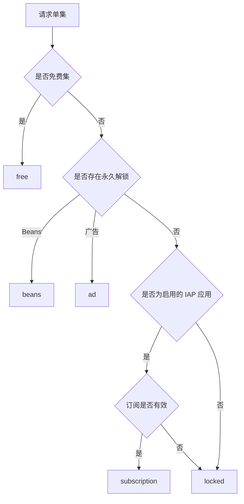
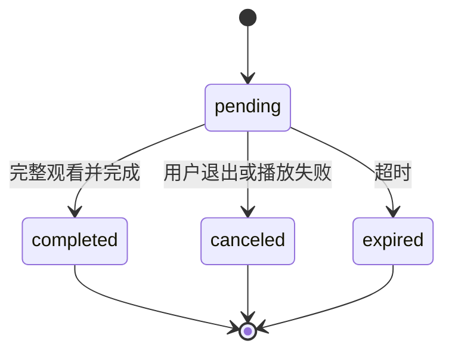

# 服务端架构设计与开发规范

> 适用范围：本目录中的 Go API、数据库模型和数据迁移代码。本文是服务端后续功能迭代的约束文档；新增功能必须遵守，确需偏离时应先更新本文并说明原因。

## 1. 架构目标

服务端采用**模块化单体**：保持部署简单，同时通过清晰分层、领域服务、事务边界和统一权益解析保证可维护性与数据一致性。

```mermaid
flowchart LR
    Admin[管理后台] --> AdminAPI[/api/v1]
    Mobile[小程序前端] --> MiniAPI[/api/mini]
    AdminAPI --> Middleware[Middleware]
    MiniAPI --> Middleware
    Middleware --> Handler[Handler]
    Handler --> Service[Service]
    Service --> Model[Model / GORM]
    Model --> DB[(MySQL 8)]
    Service --> Media[媒体存储]
```

技术栈：Go 1.22+、Gin、GORM、MySQL 8。

## 2. 目录职责

```text
backend/
├── cmd/server/          # 进程启动、依赖初始化
├── internal/
│   ├── config/          # 配置读取
│   ├── consts/          # 状态和权限等权威常量
│   ├── handler/         # 路由、参数绑定、鉴权结果和 HTTP 响应
│   ├── middleware/      # JWT、会话、权限、语言和请求去重
│   ├── model/           # GORM 模型、索引、AutoMigrate 和数据迁移
│   ├── service/         # 领域规则、事务、跨表查询和状态流转
│   └── pkg/             # 无业务归属的通用基础能力
└── migrations/         # 演示环境的初始化种子数据
```

### 依赖方向

允许：

```text
handler → service → model
middleware → model/pkg
service → model/pkg
```

禁止：

- `model` 依赖 `service` 或 `handler`。
- `service` 依赖 HTTP 请求对象或直接生成 HTTP 响应。
- `handler` 直接实现复杂 SQL、跨表事务或权益规则。
- 不同领域通过 Handler 相互调用。

## 3. 分层规范

### 3.1 Handler 层

Handler 只负责：

1. 绑定和规范化路径、查询及请求体参数。
2. 执行请求级校验。
3. 调用 Service。
4. 将领域错误映射为 HTTP 状态码和统一响应。
5. 通过路由中间件执行后台权限校验。

新增后台接口时，必须在路由上引用 `internal/consts/permissions.go` 中的权限常量，不得硬编码另一套权限 key。

### 3.2 Service 层

每个领域使用独立 Service 接口和实现，并由 `service.New` 统一注入。Service 负责：

- 业务规则和状态机。
- 跨表查询、聚合和投影。
- 事务、锁和幂等。
- 把数据库错误转换为稳定的领域错误。

复杂领域应按职责拆文件，而不是持续扩大单个文件。例如支付拆分为 Beans 订单、订阅订单、支付墙、权益和支付记录；用户查询拆分为订阅、解锁和观看记录。

### 3.3 Model 层

Model 是当前演示环境的数据库 Schema 单一真相源：

- 字段、联合唯一索引和普通索引通过 GORM Tag 声明。
- 新增模型后加入 `AutoMigrate` 列表。
- 模型不承载 HTTP 展示结构；列表或详情展示使用 Service DTO。
- 不要同时使用版本化 DDL 和 `AutoMigrate` 修改同一业务结构。

数据库策略详见 [migrations/README.md](./migrations/README.md)。

## 4. 核心领域设计

### 4.1 统一权益模型

单集访问结果必须统一为以下类型：

| 类型 | 含义 | 生命周期 |
| --- | --- | --- |
| `free` | 付费卡点之前的免费单集 | 长期 |
| `beans` | Beans 订单永久解锁 | 永久 |
| `subscription` | 有效订阅提供的访问权 | 到期失效 |
| `ad` | 激励广告永久解锁 | 永久 |
| `locked` | 当前无权播放 | — |

权益解析统一由 `entitlementResolver` 完成。新增播放入口或权益来源时，应扩展统一解析器，禁止在不同 Handler 中复制权限判断。

基本优先级：



约束：

- 永久权益唯一维度为 `(app_id, user_id, drama_id, episode_no)`。
- IAA 与 IAP 是应用级互斥模式。
- IAA 应用不通过历史订阅放行付费集。
- 锁定集不得返回真实 `videoUrl`。

### 4.2 IAA 广告会话

状态机固定为：



实现要求：

- 创建、完成、取消必须校验用户、应用、短剧和单集归属。
- 完成操作必须幂等；重复完成不得重复发放权益。
- 发放权益和完成会话必须处于同一事务。
- 变现模式或广告位配置不满足时不得创建或完成会话。
- 演示版可以信任前端完成通知；接入正式广告 SDK 时，仅替换可信验证边界，不改变权益模型。

### 4.3 IAP 与订单快照

创建订阅订单时必须冻结：

- 金额。
- 货币。
- Tier ID。
- 套餐 JSON 快照。
- Apple/Google 对应渠道价格。

历史订单展示优先读取订单快照；只有旧订单缺少快照时才允许回退当前套餐配置。禁止使用当前价格覆盖历史订单事实。

Beans 解锁订单必须记录实际 `currentEpisode` 及订单包含的集数，后台展示关联订单号。

## 5. 数据一致性规范

### 5.1 事务

下列操作必须使用事务：

- 创建、批量创建或删除 Episode，同时更新 Drama 的 `episode_count`。
- 支付完成，同时创建或更新订阅/永久权益。
- 广告会话完成，同时创建永久权益。
- 任何“业务状态 + 衍生记录”必须原子变化的流程。

同一短剧的集数结构变更需锁定 Drama 行，避免并发导致计数漂移。外部副作用（例如删除媒体文件）应在数据库事务成功后执行。

### 5.2 唯一约束

业务唯一性必须由数据库约束兜底，不能只依赖查询后插入。当前关键约束包括：

- 应用用户：`(app_id, open_id)`。
- 剧集：`(drama_id, episode_no)`。
- 支付配置：`(app_id, drama_id)`。
- 订阅周期：`(app_id, period)`。
- 订阅 Tier：`(app_id, tier_id)`。
- 永久解锁：`(app_id, user_id, drama_id, episode_no)`。

新增唯一约束前必须检查历史重复数据并提供兼容或回填策略。

### 5.3 错误处理

- 只有 `gorm.ErrRecordNotFound` 可以进入“未找到”或配置回退路径。
- SQL、连接和关联查询错误必须向上传播。
- 唯一冲突应映射为稳定领域错误。
- 禁止忽略 `Error`、用默认值掩盖数据库故障，或把数据库错误当作空列表返回。

## 6. 时间、语言与媒体

### 时间

- MySQL 业务时间统一保存为 UTC `DATETIME(3)`。
- GORM `NowFunc` 使用 UTC，数据库连接时区保持 UTC。
- API 使用三位毫秒 RFC3339 UTC。
- 后台筛选的中国运营日必须转换为 UTC 左闭右开区间。
- 新增时间字段必须纳入 UTC 约定；禁止写入本地墙上时间。

### 语言

- `/api/mini` 统一通过中间件解析 `Accept-Language`。
- 当前支持中文和英文；缺失或不支持的语言回退英文。
- Handler 和 Service 读取统一语言上下文，不重复解析请求头。

### 媒体

- 数据库保存相对媒体路径，不保存开发机器绝对路径。
- HTTP 统一通过 `/media/...` 暴露。
- 媒体目录通过配置解析，启动时确保目录存在。
- 大型视频和本地运行媒体不提交到 Git。

## 7. API 兼容规则

- 管理后台接口位于 `/api/v1`；小程序接口位于 `/api/mini`。
- 新字段优先采用向后兼容的增量方式。
- 修改请求或响应类型时，必须同步更新对应前端 contracts/types 和接口文档。
- 分页接口保持统一的 `total + list` 结构。
- 列表筛选必须在数据库分页之前完成。
- 同一业务概念必须使用一致命名，例如 `orderNo`、`sessionNo`、`unlockType`。

## 8. 新功能开发流程

新增一个服务端功能时按以下顺序实施：

1. 明确所属领域、业务状态和不变量。
2. 修改或新增 Model、索引及历史数据兼容策略。
3. 在对应 Service 中实现规则、事务、幂等和错误类型。
4. 将新 Service 加入统一依赖注入（如属于新领域）。
5. 增加薄 Handler，并在路由中配置认证、权限或语言中间件。
6. 同步管理后台或小程序的类型与接口封装。
7. 补充关键业务单元测试，至少覆盖成功、失败、重复请求和边界状态。
8. 运行验证命令并检查数据库兼容性。

### 禁止事项

- 在 Handler 中直接发放权益或更新多个业务表。
- 绕过统一权益解析器自行判断播放权。
- 以查询后插入代替数据库唯一约束。
- 在未保存订单快照时依赖可变配置还原历史价格。
- 将 IAA 与 IAP 的互斥判断只放在前端。
- 为单个页面临时发明不同的时间格式或分页协议。

## 9. 验证要求

服务端变更至少运行：

```bash
cd admin-Base/backend
gofmt -w <changed-go-files>
go test ./...
go vet ./...
```

数据库结构变更还必须验证：

- `AutoMigrate` 可在空库和现有演示库执行。
- 新索引不会被历史重复数据阻断。
- UTC 时间和小数毫秒未丢失。
- 事务失败时没有部分写入。

## 10. 演进边界

当前是演示项目，明确保留：模拟小程序身份、模拟支付结果、前端广告完成通知和启动时 `AutoMigrate`。如果进入生产化阶段，应在保持现有领域边界的基础上替换：

- TikTok/OAuth 真实身份与 Token 校验。
- Apple/Google 支付验签和服务端回调。
- 广告平台可信 completion token。
- 对象存储、CDN 和媒体转码。
- 版本化数据库迁移和生产部署审计。

这些替换不应破坏 Handler → Service → Model 的依赖方向，也不应让外部平台协议侵入统一权益模型。
