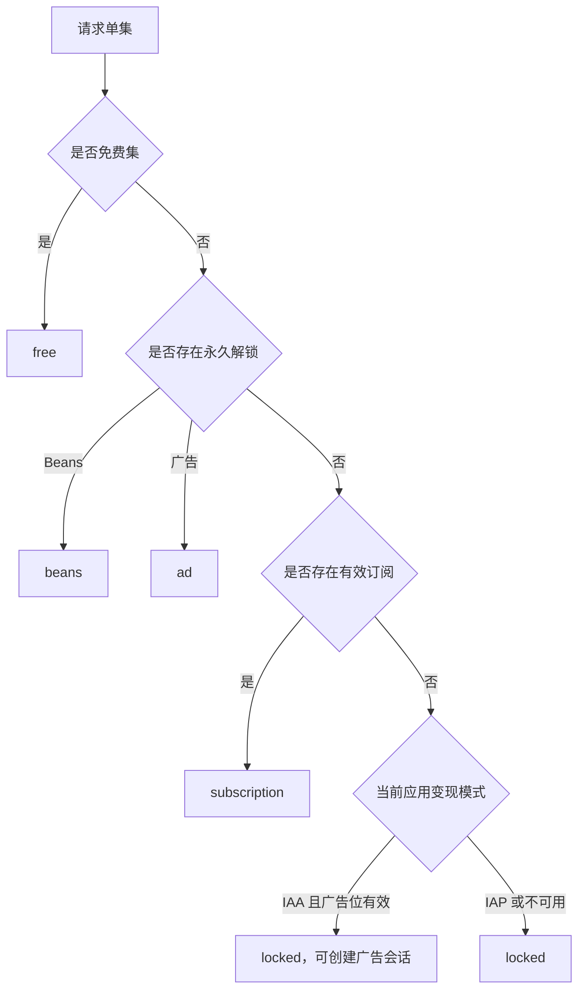
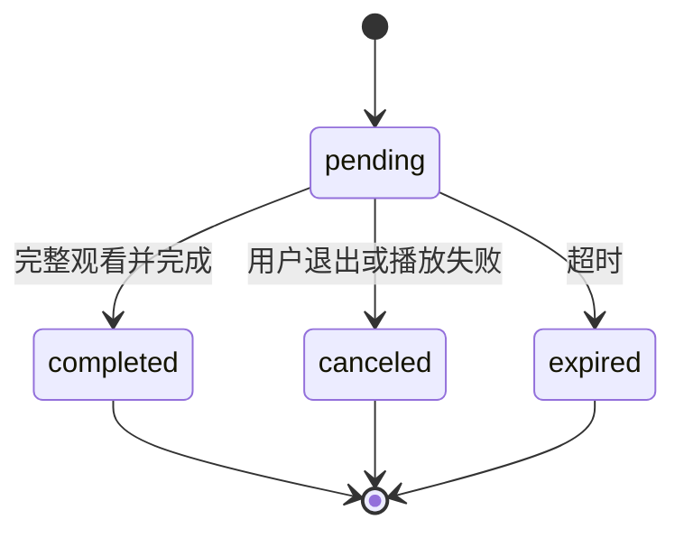

# 服务端架构设计与开发规范

> 适用范围：本目录中的 Go API、数据库模型和数据迁移代码。本文是服务端后续功能迭代的约束文档；新增功能必须遵守，确需偏离时应先更新本文并说明原因。

## 1. 架构目标

服务端采用**模块化单体**：保持部署简单，同时通过清晰分层、领域服务、事务边界和统一权益解析保证可维护性与数据一致性。

```mermaid
flowchart LR
    Admin[管理后台] --> AdminAPI[/api/v1]
    Mobile[小程序前端] --> MiniAPI[/api/mini]
    AdminAPI --> Middleware[Middleware]
    MiniAPI --> Middleware
    Middleware --> Handler[Handler]
    Handler --> Service[Service]
    Service --> Model[Model / GORM]
    Model --> DB[(MySQL 8)]
    Service --> Media[媒体存储]
```

技术栈：Go 1.22+、Gin、GORM、MySQL 8。

## 2. 目录职责

```text
backend/
├── cmd/server/          # 进程启动、依赖初始化
├── internal/
│   ├── config/          # 配置读取
│   ├── consts/          # 状态和权限等权威常量
│   ├── handler/         # 路由、参数绑定、鉴权结果和 HTTP 响应
│   ├── middleware/      # JWT、会话、权限、语言和请求去重
│   ├── model/           # GORM 模型、索引、AutoMigrate 和数据迁移
│   ├── service/         # 领域规则、事务、跨表查询和状态流转
│   └── pkg/             # 无业务归属的通用基础能力
└── migrations/         # 演示环境的初始化种子数据
```

### 依赖方向

允许：

```text
handler → service → model
middleware → model/pkg
service → model/pkg
```

禁止：

- `model` 依赖 `service` 或 `handler`。
- `service` 依赖 HTTP 请求对象或直接生成 HTTP 响应。
- `handler` 直接实现复杂 SQL、跨表事务或权益规则。
- 不同领域通过 Handler 相互调用。

## 3. 分层规范

### 3.1 Handler 层

Handler 只负责：

1. 绑定和规范化路径、查询及请求体参数。
2. 执行请求级校验。
3. 调用 Service。
4. 将领域错误映射为 HTTP 状态码和统一响应。
5. 通过路由中间件执行后台权限校验。

新增后台接口时，必须在路由上引用 `internal/consts/permissions.go` 中的权限常量，不得硬编码另一套权限 key。

### 3.2 Service 层

每个领域使用独立 Service 接口和实现，并由 `service.New` 统一创建。`cmd/server` 将 Services 与数据库显式传入 `handler.Application` 和需要数据库的 Middleware；禁止恢复 `handler.Svc`、`model.DB` 等包级运行时全局依赖。Service 负责：

- 业务规则和状态机。
- 跨表查询、聚合和投影。
- 事务、锁和幂等。
- 把数据库错误转换为稳定的领域错误。

复杂领域应按职责拆文件，而不是持续扩大单个文件。例如支付拆分为 Beans 订单、订阅订单、支付墙、权益和支付记录；用户查询拆分为订阅、解锁和观看记录。

### 3.3 Model 层

数据库启动固定分为 `model.Open`、`model.MigrateSchema`、`model.SetupCurrentData` 三个显式阶段：连接与连接池、当前 Schema、当前版本必需数据互不混杂。旧版本专用迁移和破坏性回填不得重新塞入启动流程。

Model 是当前演示环境的数据库 Schema 单一真相源：

- 字段、联合唯一索引和普通索引通过 GORM Tag 声明。
- 新增模型后加入 `AutoMigrate` 列表。
- 模型不承载 HTTP 展示结构；列表或详情展示使用 Service DTO。
- 不要同时使用版本化 DDL 和 `AutoMigrate` 修改同一业务结构。

数据库策略详见 [migrations/README.md](./migrations/README.md)。

## 4. 核心领域设计

### 4.1 统一权益模型

单集访问结果必须统一为以下类型：

| 类型 | 含义 | 生命周期 |
| --- | --- | --- |
| `free` | 付费卡点之前的免费单集 | 长期 |
| `beans` | Beans 订单永久解锁 | 永久 |
| `subscription` | 有效订阅提供的访问权 | 到期失效 |
| `ad` | 激励广告永久解锁 | 永久 |
| `locked` | 当前无权播放 | — |

权益解析统一由 `entitlementResolver` 完成。新增播放入口或权益来源时，应扩展统一解析器，禁止在不同 Handler 中复制权限判断。

基本优先级：



约束：

- 永久权益唯一维度为 `(app_id, user_id, drama_id, episode_no)`。
- IAA 与 IAP 的应用级互斥仅约束新权益获取入口；切换后不得同时创建广告会话和 IAP 订单。
- 已有 Beans/广告永久解锁跨模式继续有效，未到期订阅也继续生效，到期后自然失效。
- IAA → IAP 时，事务内取消未完成广告会话并清空 `active_key`；已完成会话及其永久权益不变。
- IAP → IAA 后禁止创建新支付订单；由于演示支付模型无法区分“尚未支付”和“已支付但回调未到”的 `pending` 订单，切换前已创建订单保留并允许按订单快照完成结算，以避免吞掉真实付款；订单结算不依赖切换后的当前模式。
- 锁定集不得返回真实 `videoUrl`。

### 4.2 IAA 广告会话

状态机固定为：



实现要求：

- 创建、完成、取消必须校验用户、应用、短剧和单集归属。
- 完成操作必须幂等；重复完成不得重复发放权益。
- 发放权益和完成会话必须处于同一事务。
- 变现模式或广告位配置不满足时不得创建或完成会话。
- 演示版可以信任前端完成通知；接入正式广告 SDK 时，仅替换可信验证边界，不改变权益模型。

### 4.3 IAP 与订单快照

创建订阅订单时必须冻结：

- 金额。
- 货币。
- Tier ID。
- 套餐 JSON 快照。
- Apple/Google 对应渠道价格。

历史订单展示优先读取订单快照；只有旧订单缺少快照时才允许回退当前套餐配置。禁止使用当前价格覆盖历史订单事实。

Beans 解锁订单必须记录实际 `currentEpisode` 及订单包含的集数，后台展示关联订单号。

## 5. 数据一致性规范

### 5.1 事务

下列操作必须使用事务：

- 创建、批量创建或删除 Episode，同时更新 Drama 的 `episode_count`。
- 支付完成，同时创建或更新订阅/永久权益。
- 广告会话完成，同时创建永久权益。
- 任何“业务状态 + 衍生记录”必须原子变化的流程。

同一短剧的集数结构变更需锁定 Drama 行，避免并发导致计数漂移。单集更新和删除必须同时校验 URL 中的剧集 ID 与单集归属；追加和替换不受剧集上下架状态限制，删除则必须先下架剧集且只能从最后一集开始。外部副作用（例如删除媒体文件）应在数据库事务成功后执行。

### 5.2 唯一约束

业务唯一性必须由数据库约束兜底，不能只依赖查询后插入。当前关键约束包括：

- 应用用户：`(app_id, open_id)`。
- 剧集：`(drama_id, episode_no)`。
- 支付配置：`(app_id, drama_id)`。
- 订阅周期：`(app_id, period)`。
- 订阅 Tier：`(app_id, tier_id)`。
- 永久解锁：`(app_id, user_id, drama_id, episode_no)`。

新增唯一约束前必须检查历史重复数据并提供兼容或回填策略。

### 5.3 推广末次归因

- `app_users.current_promotion_link_id` 保存用户当前生效的末次推广 Linkid。
- 小程序根布局仅在任意页面被外部直接打开或浏览器刷新时上报入口参数；客户端内部路由跳转不得重复上报。URL 中存在小驼峰 `linkId` 时调用独立的 `POST /api/mini/users/activate`，无 Linkid 的自然入口不改变当前归因。
- 激活上报接口只维护归因，不返回目标剧集、不控制页面导航；登录仍只负责建立或恢复身份。接口必须锁定用户行，并在同一事务内完成当前 Linkid 更新与 `promotion_attribution_histories` 历史插入。
- 用户首次关联或切换到不同 Linkid 时写入一条历史；重复进入相同 Linkid 不更新用户，也不重复写历史。
- 历史记录保留变更前 Linkid（首次为空）和变更后 Linkid，作为不可变归因事实。
- 登录和用户详情响应必须返回服务端当前 Linkid；无归因时明确返回 `null`，供非推广入口恢复当前关联。
- 支付订单和广告解锁会话创建时从服务端用户记录保存归因 Linkid 快照；前端不在这些业务请求中传入可信 Linkid。后续支付结果和广告终态沿用创建时快照，不按用户最新归因改写；复用 pending 广告会话时也保留原快照。

### 5.4 媒体事件上报留档

- TikTok 媒体事件由小程序通过 SDK 直接上报；服务端不调用 SDK、不转发、不补发，只接收 SDK 最终回调结果用于媒体核对。
- 小程序在 SDK 回调后写一次结果；客户端不支持 `reportEvent` 时以 `unsupported` 终态写一次。状态固定为 `success`、`failed`、`unsupported`。
- `userId` 对应用户的 `app_id` 和当前归因 Linkid 由服务端读取并保存请求时快照；客户端不得传入可信 `appId` 或 `linkId`。剧集、集数、事件名、SDK 参数和完整回调结果由客户端提供并校验。
- `media_event_reports` 使用 `(app_id, report_id)` 联合唯一约束兜底幂等。相同 `reportId` 和相同内容重试返回原记录，不重复落库；同一 ID 对应不同内容必须返回冲突。
- `params_json` 和 `result_json` 使用 MySQL JSON 保存，均只接受 JSON 对象并限制大小；接口请求体也必须限制大小。事件名只校验稳定格式，不采用固定白名单阻断媒体新增事件。
- 媒体事件日志是审计事实，不参与支付、广告解锁或权益状态流转。
- 管理后台通过 `GET /api/v1/media-event-reports` 查询，通过 `GET /api/v1/media-event-reports/export` 按相同筛选条件导出；权限分别为 `campaign.media-event.list` 和 `campaign.media-event.export`。
- 后台筛选支持用户ID、Linkid、小程序、剧集、事件名称、状态和上报时间。上报时间使用记录的 `created_at`，以中国运营时区的自然日解析为 UTC 半开区间查询；DTO 统一输出 UTC，前端和导出再按后台展示时区格式化。剧集筛选与推广链接保持一致：纯数字按完整剧集 ID 精准匹配，非纯数字按剧集名称模糊匹配；列表 DTO 同时返回 `monetizationType`、`dramaName`、`dramaId` 和 `reportedAt`，导出时将小程序名称与变现类型、剧集名称与剧集 ID 分列并包含上报时间。`reportId` 仅用于接口幂等，不属于运营展示或导出字段；`params_json` 和 `result_json` 都在后台响应边界解码为 JSON 对象，分别展示为 SDK 原始参数和 SDK 上报结果。导出时两者分别成列，编码为两空格缩进的多行 JSON；JSON 单元格不自动换行，并固定数据行高度，用户可选中单元格查看完整内容。

### 5.5 流式导出

- XLSX 导出统一使用 `internal/pkg/xlsxstream`，业务 Handler 只声明表头、样式、列宽和行映射，禁止自行创建 Workbook。
- 导出数据源必须在 Service 中按稳定排序分批迭代，默认每批 500 条；禁止为了导出一次性加载全部匹配记录。
- 列名、顺序、筛选、文件名、MIME type 和字段格式属于现有接口契约，重构不得改变。
- 多行 JSON 等特殊展示由业务 Handler 通过助手配置，但不得复制流式写入生命周期。

### 5.6 后台会话

- 管理员 Session 必须在每次受保护请求中同时校验 Token 和账号启用状态。
- 管理员被禁用时，更新状态与清空 `session_token` 必须在同一事务内完成；当前禁用请求可以成功，后续请求统一返回 401，由管理后台清除本地 Token 并返回登录页。
- `consts.PermissionTree` 是有效权限白名单；启动同步必须清理所有角色中已从权限树移除的权限 key，再补齐超级管理员的当前权限。

### 5.7 错误处理

- 只有 `gorm.ErrRecordNotFound` 可以进入“未找到”或配置回退路径。
- SQL、连接和关联查询错误必须向上传播。
- 唯一冲突应映射为稳定领域错误。
- 禁止忽略 `Error`、用默认值掩盖数据库故障，或把数据库错误当作空列表返回。

## 6. 时间、语言与媒体

### 时间

- MySQL 业务时间统一保存为 UTC `DATETIME(3)`。
- GORM `NowFunc` 使用 UTC，数据库连接时区保持 UTC。
- API 使用三位毫秒 RFC3339 UTC。
- 后台筛选的中国运营日必须转换为 UTC 左闭右开区间。
- 新增时间字段必须纳入 UTC 约定；禁止写入本地墙上时间。

### 语言

- `/api/mini` 统一通过中间件解析 `Accept-Language`。
- 当前支持中文和英文；缺失或不支持的语言回退英文。
- Handler 和 Service 读取统一语言上下文，不重复解析请求头。

### 媒体

- 数据库保存相对媒体路径，不保存开发机器绝对路径。
- HTTP 统一通过 `/media/...` 暴露。
- 媒体目录通过配置解析，启动时确保目录存在。
- 大型视频和本地运行媒体不提交到 Git。

## 7. API 兼容规则

- 管理后台接口位于 `/api/v1`；小程序接口位于 `/api/mini`。
- 新字段优先采用向后兼容的增量方式。
- 修改请求或响应类型时，必须同步更新对应前端 contracts/types 和接口文档。
- 分页接口保持统一的 `total + list` 结构。
- 列表筛选必须在数据库分页之前完成。
- 同一业务概念必须使用一致命名，例如 `orderNo`、`sessionNo`、`unlockType`。

### 推广链接与激活

- `promotion_links.link_id` 同时是主键和业务 Linkid，由 MySQL 自增生成，首个值为 `10000001`；禁止使用 `MAX + 1`。
- 推广关系和目标剧集由服务端管理。后台创建接口接受应用、剧集、付费卡点、可选名称，以及 IAP 应用必填的单集 Beans 价格；创建人来自 JWT，应用必须启用，剧集必须上架。
- `promotion_links.paywall_episode` 是所有推广链接的创建时运营配置快照；`promotion_links.beans_per_ep` 仅用于 IAP，IAA 必须保存为 `NULL`。创建服务必须按实际剧集总集数校验卡点为 `1..episode_count`；IAP 单集价格必须存在且为 `10..500`。
- 当前用户存在有效归因 Linkid 时，服务端集中解析推广运营配置：IAP 的 `beans_per_ep` 对用户观看的所有剧集生效；仅当当前剧集等于推广链接关联剧集时，`paywall_episode` 覆盖剧集默认卡点，其他剧集保留默认卡点。逐集权益、付费面板、Beans 建单和广告会话必须复用同一规则，前端不得自行计算。不存在、跨应用或已失效的 Linkid 按无推广配置回退，其他数据库错误必须向上传播。
- 后台推广链接列表与导出复用同一套数据库筛选规则；列表在筛选后分页，导出则返回全部匹配记录，并通过独立的 `campaign.link.export` 权限保护。
- 后台广告会话通过 `/api/v1/ad-sessions` 查询、`/api/v1/ad-sessions/export` 导出；用户 ID、Linkid、应用、剧集 ID、状态和中国运营日期区间使用同一套筛选，列表分页、导出全部匹配记录。列表和导出末列均返回广告业务会话编号 `sessionNo`（数据库 `session_no`），而非数据库主键。导出列由 `columns` 白名单控制，并分别由 `finance.ad-session.list`、`finance.ad-session.export` 保护。
- 推广链接直接指向配置的移动端播放页，固定格式为 `/player?dramaId={dramaId}&linkId={linkId}`；省略 `episode` 由播放器默认进入第一集，不再经过后端 302 中转。
- 小程序取得用户身份后，以 `userId + linkId` 调用 `/api/mini/users/activate`。Linkid 缺失或为空时保持当前归因并返回 `attributionUpdated=false`；服务端仅在 Linkid 非空时校验推广链接与用户属于同一应用。

## 8. 新功能开发流程

新增一个服务端功能时按以下顺序实施：

1. 明确所属领域、业务状态和不变量。
2. 修改或新增 Model、索引及历史数据兼容策略。
3. 在对应 Service 中实现规则、事务、幂等和错误类型。
4. 将新 Service 加入统一依赖注入（如属于新领域）。
5. 增加薄 Handler，并在路由中配置认证、权限或语言中间件。
6. 同步管理后台或小程序的类型与接口封装。
7. 补充关键业务单元测试，至少覆盖成功、失败、重复请求和边界状态。
8. 运行验证命令并检查数据库兼容性。

### 禁止事项

- 在 Handler 中直接发放权益或更新多个业务表。
- 绕过统一权益解析器自行判断播放权。
- 以查询后插入代替数据库唯一约束。
- 在未保存订单快照时依赖可变配置还原历史价格。
- 将 IAA 与 IAP 的互斥判断只放在前端。
- 为单个页面临时发明不同的时间格式或分页协议。

## 9. 验证要求

服务端变更至少运行：

```bash
cd admin-Base/backend
gofmt -w <changed-go-files>
go test ./...
go vet ./...
```

数据库结构变更还必须验证：

- `AutoMigrate` 可在空库和现有演示库执行。
- 新索引不会被历史重复数据阻断。
- UTC 时间和小数毫秒未丢失。
- 事务失败时没有部分写入。

## 10. 演进边界

当前是演示项目，明确保留：模拟小程序身份、模拟支付结果、前端广告完成通知和启动时 `AutoMigrate`。如果进入生产化阶段，应在保持现有领域边界的基础上替换：

- TikTok/OAuth 真实身份与 Token 校验。
- Apple/Google 支付验签和服务端回调。
- 广告平台可信 completion token。
- 对象存储、CDN 和媒体转码。
- 版本化数据库迁移和生产部署审计。

这些替换不应破坏 Handler → Service → Model 的依赖方向，也不应让外部平台协议侵入统一权益模型。
