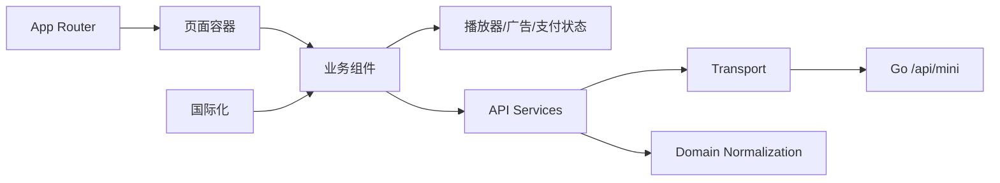
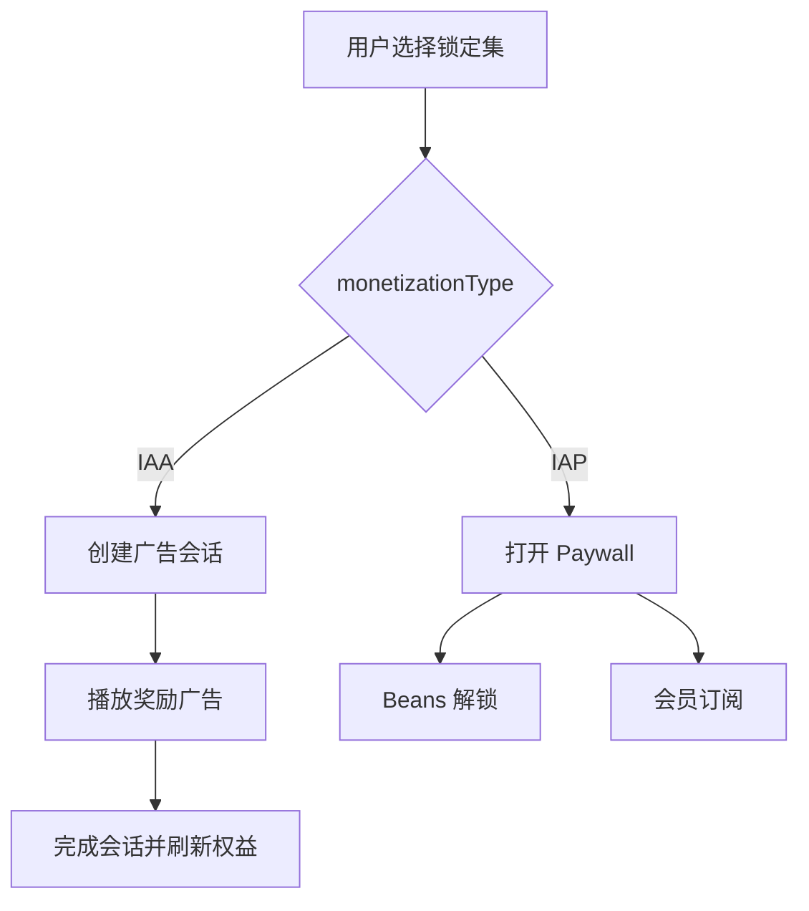

# 小程序前端架构设计与开发规范

> 适用范围：本目录中的用户端 Next.js 应用。本文是小程序前端后续功能迭代的约束文档；新增功能必须遵守，确需偏离时应先更新本文并说明原因。

## 1. 架构目标

小程序前端采用 Next.js App Router + React + TypeScript，重点保证：

- 页面、业务组件、领域转换和 HTTP 传输分离。
- IAA 与 IAP 由应用配置统一分流。
- 剧集播放权只消费服务端统一权益结果。
- 播放器、广告和支付流程使用独立状态逻辑。
- 请求、定时器、媒体事件和组件卸载均有明确清理。
- 国际化和设备本地时区处理集中管理。



## 2. 目录职责

```text
mobile-app/
├── app/                       # App Router、根页面和全局样式
├── components/                # 首页、登录、播放器、付费墙和个人中心
│   ├── video-player/          # 播放器子组件、Hooks 和纯函数
│   └── payment/               # 支付相关子组件或状态逻辑
├── lib/
│   ├── api/
│   │   ├── contracts.ts       # API 请求/响应 DTO
│   │   ├── domain.ts          # 领域数据规范化和纯业务函数
│   │   ├── platform.ts        # API 地址与运行环境识别
│   │   ├── transport.ts       # Fetch、Token、语言和错误处理
│   │   └── services.ts        # 语义化领域 API
│   ├── i18n/                  # 中英文文案和语言能力
│   └── utils.ts               # 无业务归属的通用工具
└── public/                    # 静态图片和图标
```

依赖方向：

```text
app → components → lib/api/services
components → component hooks/helpers
api/services → transport + contracts + domain
transport → platform
```

禁止 `transport` 依赖页面组件，也禁止组件绕过 Services 直接拼 API 路径。

## 3. API 分层规范

### 3.1 Contracts

[lib/api/contracts.ts](./lib/api/contracts.ts) 是小程序 API DTO 的集中定义位置：

- 请求和响应字段与服务端保持一致。
- 领域枚举使用联合类型，例如 `IAA | IAP`、`free | beans | subscription | ad | locked`。
- 可空和可选字段必须如实表达。
- 修改服务端响应时同步修改 Contracts，禁止通过 `any` 暂时绕过。

### 3.2 Domain

[lib/api/domain.ts](./lib/api/domain.ts) 只包含无副作用的领域转换，例如：

- 规范化剧集编号和访问状态。
- 合并重复剧集。
- 按真实编号排序。
- 从剧集列表查找前一集和后一集。

网络请求和 React 状态不能放进 Domain。

### 3.3 Platform

[lib/api/platform.ts](./lib/api/platform.ts) 统一确定 API 地址：

- 优先使用显式环境变量。
- 本地或局域网访问时，使用当前 hostname 和服务端端口。
- 组件中不得硬编码 `localhost`、局域网 IP 或 `:8080`。

### 3.4 Transport

[lib/api/transport.ts](./lib/api/transport.ts) 统一处理：

- `fetch`。
- Token 和公共请求头。
- `Accept-Language`。
- JSON 编解码。
- HTTP/API 错误。
- `AbortSignal` 和必要的 `keepalive`。

业务组件禁止直接实现另一套传输逻辑。

### 3.5 Services

[lib/api/services.ts](./lib/api/services.ts) 按登录、应用、短剧、观看、支付和广告等领域提供语义化方法。组件只调用 Service，不拼 URL，不理解统一响应壳。

## 4. 页面和组件边界

### 页面容器

`app/` 只负责 Next.js 入口、全局布局和顶层页面装配。复杂业务不得全部堆积到 `app/page.tsx`。

### 业务组件

- `HomePage`：短剧浏览和进入播放器。
- `LoginPage`：应用选择和演示登录。
- `MePage`：用户资料、会员和功能入口。
- `PurchaseRecordsPage`：支付历史。
- `PaywallPanel`：IAP 支付墙和支付状态机。
- `VideoPlayer`：组织播放器各子模块。

当一个组件同时处理多个独立状态机时，必须拆分到专用 Hook 或子组件。

## 5. 播放器架构

播放器相关能力位于 [components/video-player/](./components/video-player)：

| 模块 | 职责 |
| --- | --- |
| `usePlaybackControls` | 播放、暂停和控制层状态 |
| `useVideoViewport` | 视口、尺寸及全屏相关状态 |
| `VideoPlayerEpisodeList` | 剧集列表展示与选择 |
| `helpers` | 无副作用的播放辅助函数 |
| `useRewardedAdUnlock` | 广告会话状态机和 API 调用 |
| `RewardedAdOverlay` | 广告视频、倒计时和退出确认 UI |

[components/VideoPlayer.tsx](./components/VideoPlayer.tsx) 负责组合这些模块，不应重新吸收其内部逻辑。

### 剧集导航

- 必须依据服务端返回的真实剧集列表导航。
- 支持不连续剧集编号。
- 禁止使用 `currentEpisode + 1`、`currentEpisode - 1` 或 `episodes.length` 推断真实集号。
- 用户可以直接选择任意锁定剧集，不实施顺序解锁限制。

### 播放安全边界

- 锁定集没有 `videoUrl` 时不创建空视频节点。
- 前端不得自行猜测播放权。
- 解锁后重新拉取服务端剧集/权益数据，再进入播放。
- 观看记录中的 `unlockType` 使用服务端判定结果。

## 6. 统一权益消费

小程序消费以下权益结果：

| 类型 | 前端行为 |
| --- | --- |
| `free` | 直接播放 |
| `beans` | 直接播放，可展示 Beans 来源 |
| `subscription` | 订阅有效期内播放 |
| `ad` | 直接播放，可展示广告解锁来源 |
| `locked` | 根据应用变现模式进入广告或付费墙 |

前端只负责流程分流，不能自行从订单、会员或广告历史重新计算最终播放权。

## 7. IAA/IAP 分流

应用配置中的 `monetizationType` 是唯一分流依据：



规则：

- IAA 用户不展示会员卡和购买记录入口。
- IAP 用户不进入广告会话流程。
- 广告位缺失时显示不可用错误，不回退到 IAP。
- 应用配置在登录后、页面重新可见、窗口重新获得焦点及进入个人中心等关键时机刷新。
- 前端显隐不替代服务端对变现模式的校验。

## 8. 奖励广告状态机

广告 UI 和服务端会话分离：

- `RewardedAdOverlay` 负责媒体播放、缓冲、暂停和退出确认。
- `useRewardedAdUnlock` 负责创建、完成、取消和清理会话。

必须保证：

1. 防止快速点击产生重复创建请求。
2. 奖励计时只在视频真实播放时推进。
3. 暂停、缓冲和退出确认期间停止计时。
4. 继续观看时恢复视频和计时。
5. 视频加载失败时取消 `pending` 会话。
6. 完整观看后才调用完成接口。
7. 完成请求可以安全重试。
8. 组件卸载时中止请求、清理定时器，并尝试取消未完成会话。
9. 完成后重新获取服务端权益，再播放目标集。

演示视频只是 UI 实现。未来接入 TikTok 广告 SDK 时，应替换 Overlay 的媒体完成来源，并保留会话与权益边界。

## 9. IAP 支付墙状态机

[components/PaywallPanel.tsx](./components/PaywallPanel.tsx) 使用 reducer 管理：

- 配置加载。
- 创建 Beans 或订阅订单。
- 模拟支付上报。
- 成功、失败和关闭。
- 请求中止及定时器清理。

订单请求必须携带用户实际选中的 `currentEpisode`。支付成功后不直接伪造本地权益，应重新获取服务端结果。

## 10. 国际化与时间

### 国际化

- 所有面向用户的文案集中在 [lib/i18n/](./lib/i18n)。
- 当前支持中文和英文。
- API 请求统一携带 `Accept-Language`。
- 不支持的语言回退英文。
- 禁止在组件中散落 `language === ...` 的重复文案表。

### 时间

- API 时间视为 UTC RFC3339。
- 小程序展示时转换为设备本地时区。
- 禁止写死 UTC+8 或手动增减小时数。
- 新增格式化能力时放到公共工具中，不在多个页面复制。

## 11. 浏览器历史与生命周期

- 页面进入播放器或购买记录时，应维护明确的浏览状态。
- 返回操作不能错误覆盖主页已有 History 项。
- 组件卸载、页面隐藏和请求替换时必须处理 AbortController、定时器及未完成会话。
- 任何依赖 `visibilitychange`、`focus` 或媒体事件的监听器都必须成对清理。

## 12. 新功能开发流程

新增小程序功能时按以下顺序：

1. 明确服务端接口和最终权益边界。
2. 更新 `contracts.ts`。
3. 如有领域规范化，加入 `domain.ts` 的纯函数。
4. 在 `services.ts` 增加语义化 API。
5. 将复杂异步流程放入专用 Hook 或 reducer 状态机。
6. 使用业务组件组织 UI，保持页面入口轻量。
7. 补充中英文文案。
8. 处理加载、失败、重复点击、取消和卸载场景。
9. 运行 TypeScript 检查、生产构建和浏览器流程验证。

### 禁止事项

- 组件中直接拼接 `/api/mini` 路径。
- 使用 `any` 掩盖接口字段变化。
- 在前端重新实现服务端权益算法。
- 让广告视频 UI 直接写入永久权益。
- IAA 配置失败时静默打开 IAP 支付墙。
- 用本地状态假装支付或广告权益已经生效。
- 忽略 AbortController、定时器或媒体监听器清理。
- 恢复“必须按顺序解锁剧集”的旧限制。

## 13. 验证要求

小程序变更至少运行：

```bash
cd mobile-app
pnpm exec tsc --noEmit --incremental false
pnpm run build
```

涉及用户流程时还应验证：

- 中英文界面。
- IAA 与 IAP 两类应用。
- 任意锁定集选择。
- 广告完整观看、取消、加载失败和重复完成。
- Beans 解锁与会员订阅。
- 解锁后自动刷新并播放目标集。
- 局域网访问时 API 指向服务端而不是前端自身。
- 时间按设备本地时区显示。
- 播放器和购买记录的浏览器返回行为。

## 14. 演进边界

当前项目使用 Web 页面模拟小程序环境。生产化时可以接入 TikTok SDK、真实支付和广告平台，但必须保持：

- Contracts / Domain / Platform / Transport / Services 分层。
- 统一权益结果由服务端决定。
- 广告 UI 与服务端会话解耦。
- 支付和广告流程具有可取消、可清理的状态机。
- 应用级 IAA/IAP 互斥配置。
